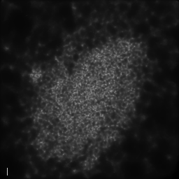
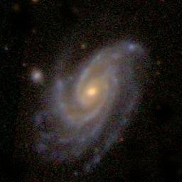
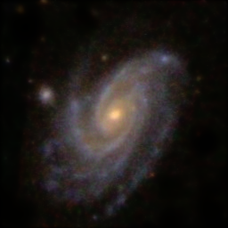
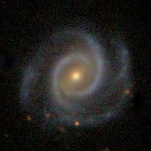
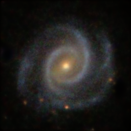
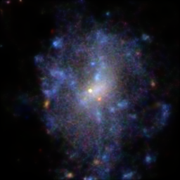
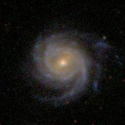
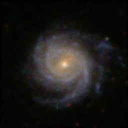
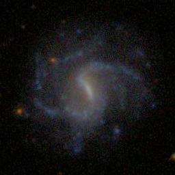
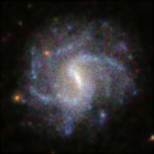

# ImageCleaning

## Description

This is a simple brute force anisotropic adaptive image filter. The results are similar to wavelet filtering. The algorithm is based on montecarlo sampling an image and constructing an image from the Delaunay tessellation of the sampled points. This is done on each channel independently. The trick to avoid ugly Delaunay artifacts is to create an ensemble of Montecarlo samplings and add them at the end. As the icing on the cake the method conserves flux in a straightforward way.

The method is quite slow and one needs a large number of realizations to produce a high-quaity smooth result. Since the main point of the method is to clean shallow regions in the image I did a weighted image addition between the clean and image to add the bright regions in the original and the dark regions from the cleaned image. This is a dirty trick that works well for visualization purposes. For more serious applications one just needs to compute a much large ensemble.

The method works surprisingly well. On the left the original images. Note the strong jpeg artifacts. On the right the cleaned images. There are no noticeable jpeg artifacts and the shot noise in the dark regions is smoothed. The clean images were computed from a 2048-realization ensemble. Each image took ~1 minute to compute. It is way too slow but the code is not optimized in any way.

 

 

 

 

 

